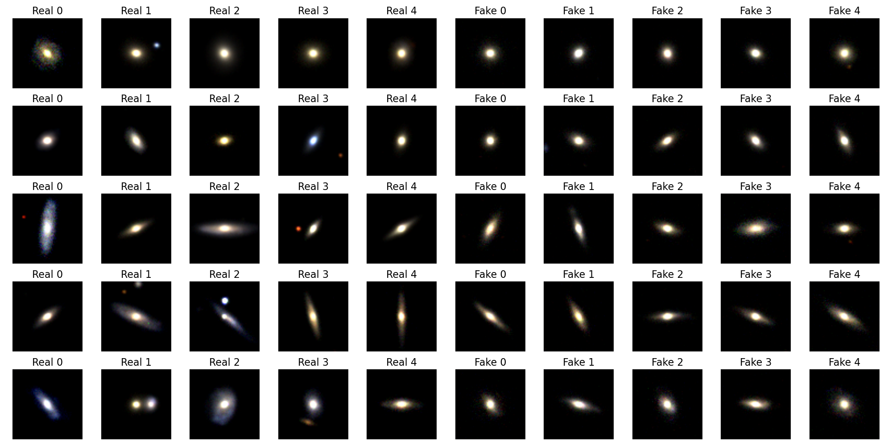

# Conditional Galaxy Image Generation via Morphological and Physical Attributes
## Project Description
This project is a conditional galaxy image generation model based on a conditional diffusion model.
We used morphological and physical features as guiding conditions to generate realistic galaxy images.



## Prerequisites
### 1. Clone the Repository
```shell
git clone https://github.com/I-Choose-A/galaxy_ddpm.git
cd galaxy_ddpm
```
### 2. Install Dependencies
```shell
pip install -r requirements.txt
```
### 3. Download Data
To train the DDPM model, you need to download the dataset manually:

1. File Link: [SDSS dataset](https://deepdip.iap.fr/#item/60ef1e05be2b8ebb048d951d) from the study by [Pasquet et al.](https://deepdip.iap.fr/#item/60ef1e05be2b8ebb048d951d)
2. Target Path: Please place the downloaded file in `./data_files` directory of this project. 
3. The final path of the file should be similar to: `galaxy_ddpm/data_files/sdss.npy`.

### 4. Download Trained Model Weights
In addition to retraining, you can also use our trained model weights for diffusion model sampling and metric calculation. 
(You need to configure the path in hyperparameter configuration dictionary `modelConfig` in the corresponding Python script.)
1. File Link: [DDPM Weight](https://drive.google.com/file/d/1pqzY9_uDn7oFB1hnNMSv7EZzMVFqbKY-/view?usp=sharing) and [Inception-v3 Weight](https://drive.google.com/file/d/1nbol0UNcVfNd17ot29fH9i4gXuyFm8Pn/view?usp=sharing)
2. Target Path: Please place the downloaded files in `./checkpoints` directory of this project. 
If the directory does not exist, create it manually. 
3. The final path of the files should be similar to: `galaxy_ddpm/checkpoints/ckpt_29+9+9_cDDPM.pt` and `galaxy_ddpm/checkpoints/best_inception_epoch.pth`.

## How to Run
After completing all of the above preparations, you can start the model training or inference script via the command line.
### 1. Run Diffusion Model
By editing the hyperparameter configuration dictionary `modelConfig` in `main.py`, you can choose whether to train the diffusion model or generate samples, as well as modify other parameters.
```shell
python main.py
```
### 2. Train Inception-3 Model
Train the Inception-v3 model used to calculate the IS Score and FID Score.
```shell
python -m metrics.train_inception.py
```

### 3. Compute IS Score
Calculate the IS Score of the generated samples using the following command.
```shell
python -m metrics.is
```

### 4. Compute FID Score
Calculate the FID Score of the generated samples using the following command.
```shell
python -m metrics.fid
```

### 4. Show Images
Use the following commands to display samples of real and generated galaxy images.
```shell
python -m utils.show_image
```
